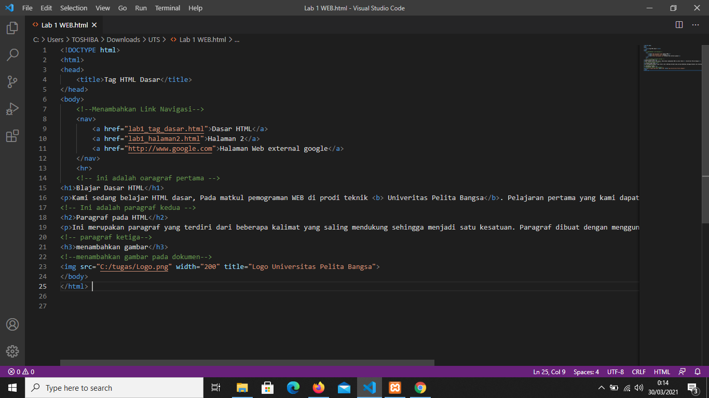

# tuas_praktek 
## Blajar tag  dasar html
<!DOCTYPE>
DOCTYPE merupakan suatu deklarasi memberitahukan kepada browser jnis dan versi html yang di gunakan pada bariskode diatas kitamenggunakan jenis dan versi untuk html 5 yang saat ini sudah terbilang moderen.

HEAD 
biasa digunakan untuk menemukan informasi pada suatu dokumen html.baris tersebut merupakan baris yang penting dan harus ada di setiap web

TITLE
biasa di gunakan pada baris judul di setiap halaman dan baris tersebut sangat penting di gunakan dalam membuat web

BODY
baris yang berisi konten pada web,seperti Heading,Div,image,Footer dan sebagainya

 ### belajar mengisi tag
  #### membuatparagraf

